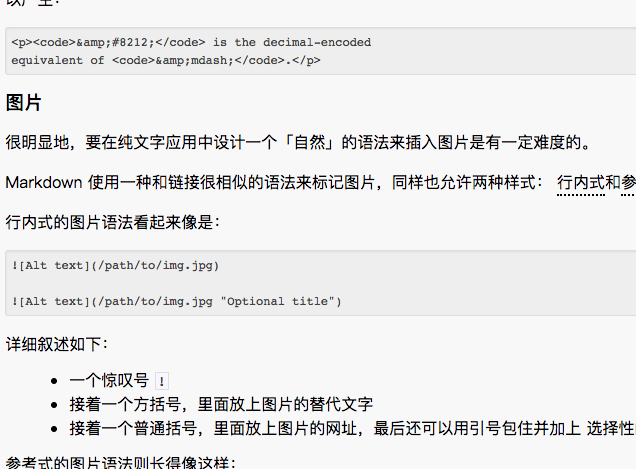

#title
paralagr
##h2
###h3
####h4
#####h5
######h6

#dot
- dot1
    - dot2
        - dot3
        - dot3
        ````bojc
        ````
    - dot3
- dot1
- dot1

#block quotes

>my name is jaie
hahhah
>> inner quotes
>>> inner quotes

>1. first row
>2. second row

#list 
* red
* green
* blue

+ red
+ green
+ blue

- red
- green
- blue

#list of order
1.  one
    sdjflslf
    sdjflsdjfls
    fsdlfjsdlfs
1.  one
1.  one
1.  one

#
1.  one
    sdjflslf
    sdjflsdjfls
    fsdlfjsdlfs
    
1.  one

1.  one

1.  one

***
*   dsfsdfsdfsdfs
    > quote

#code
text normal

    //javascript
    var a = 0;
    
text normal

***

Here is an example
    
    tell applcation "Foo"
        beep
    end
    
end example

***

html example
    
    <code>
        <div>*</div>
    </code>

end example

***

#link

*   innerLink
    
    This is [an example](https://baidu.com/q?example "Title") of URL inline link.
    This is [an example][id] reference-style link
    https://www.google.com
    
    visit Paragraph 1
    
#emphasize

some word need *emphasize*

#code
`console.log('jamie')` 

``There is a literal backtick (`) here.``

`` There is a literal backtick (`) here. ``

please don't use any `<p></p>` tags


[id]: https://baidu.com/q?example "jamie example"
&copy;jamieTsang

#image



#auto Link
<https://google.com/>